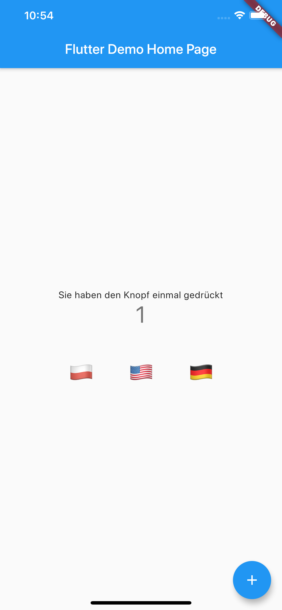
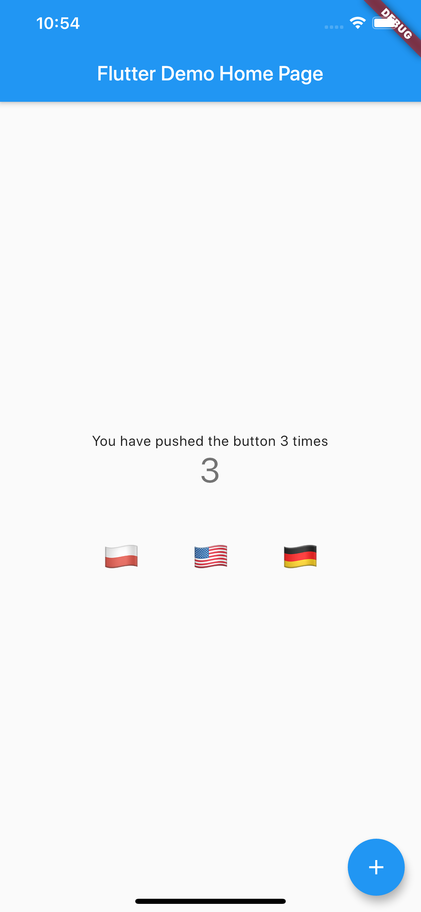

# i18n example

App showing how to efficiently use localization

## Screenshots

|   |   |   |
|---|---|---|
|  |  |  | 

## Learn more

See [the blog post](https://roszkowski.dev/2020/i18n-in-flutter/) to learn more about this app and how to quickly add internationalization to your Flutter app.

You can also watch the video [here](https://www.youtube.com/watch?v=3IRGTTjVHug).
